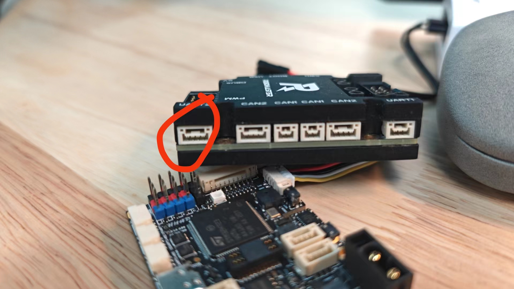

# Time synchrononization hardware

you should only check `Src/main.c`:`void HAL_TIM_PeriodElapsedCallback(TIM_HandleTypeDef *htim)` and `module/syn/syn.c`.

And configure your timer and PWM in STM32CubeMX.

These code is suitable for STM32F407 series. It has been tested on RoboMaster dev board type-C.

This repo is based on https://github.com/HNUYueLuRM/basic_framework

TO implemente this in other boards, you need to configure a 1Hz timer (interrupt) for sending GPRMC msg to computer, and generate a 1Hz PWM for lidar PPS with the same TIM used for 1Hz PWM. Then configure another timer for 10Hz (or any freq you like) PWM to trigger cam acquisition.

TO send pseudo-GPRMC, configure a uart with 115200 baud rate(default value), 8 data bit, 1 stop, no parity. DMA or IT is recommended.

Connect tim-1 channel 1 to PPS, connect tim-8 channel 1 to camera trigger. Connect USART1 to computing platform and give the serial port with permisson:`sudo chmod 777 /dev/ttyUSBx` where 'x' is the number. Be sure that the baud rate of the MCU is aligned with configuration in Livox ros driver.

The red circle is **serial port 1** (igore the mimeograph "serial 2")

Refer to `RoboMaster Development Board Type C User Manual.pdf` for more details