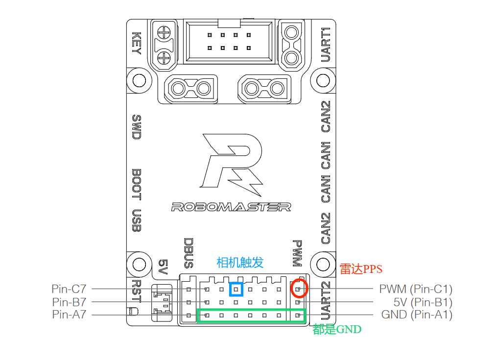

# 时间同步硬件

若使用Robomaster C型板您只需要检查 `Src/main.c`:`void HAL_TIM_PeriodElapsedCallback(TIM_HandleTypeDef *htim)` 和 `module/syn/syn.c`。

并在 STM32CubeMX 中配置定时器和 PWM。这些代码适用于STM32F407系列。已在 RoboMaster 开发板 Type-C 上进行测试。此存储库基于 https://github.com/HNUYueLuRM/basic_framework 

要在其他板中实现此功能，您需要配置一个 1Hz 定时器（中断）用于将 GPRMC 消息发送到计算机，并使用以下命令为激光雷达 PPS 生成 1Hz PWM 1Hz PWM 使用相同的 TIM。然后为 10Hz（或您喜欢的任何频率）PWM 配置另一个计时器以触发凸轮采集。要发送伪 GPRMC，请配置一个波特率 9600、8 个数据位、1 个停止位、无奇偶校验的 uart。建议使用 DMA 或 IT。

将 tim-1 通道 1 连接到 PPS，将 tim-8 通道 1 连接到相机触发器。将 USART1 连接到计算平台并授予串口权限：“sudo chmod 777 /dev/ttyUSBx”，其中“x”是数字。 

 

红色圈出的是串口1（丝印为串口2）

 

更多详情请参考`RoboMaster  开发板 C 型用户手册.pdf`